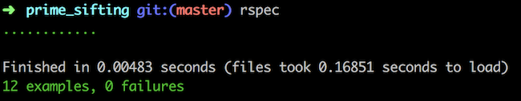

# prime_sifting

## GitHub repository: https://github.com/r-craig73/prime_sifting

#### By Ron Craig (https://github.com/r-craig73) & David Lewis

## Description
#### An Epicodus lesson 02/07/2018: Write a method that returns all of the prime numbers less than the input number.

#### Prime Sifting Case Specs (7 out of 9 specs passing)
1. The method returns an error if a user inputs 1
  * input: number_input = Prime.new(1)
  * output: expect(number_input.prime_sifter).to(eq('zero is not a prime number'))
2. The method returns a nickel when a user inputs 5 cents
  * input: coin = number_input = Prime.new(2)
  * output: expect(number_input.prime_sifter).to(eq('one is not a prime number'))
3. The method creates an array of prime number 2 when a user inputs 3
  * input: number_input = Prime.new(3)
  * output: expect(number_input.prime_sifter).to(eq([2]))
4. The method creates an array of prime numbers when a user inputs 4
  * input: number_input = Prime.new(4)
  * output: expect(number_input.prime_sifter).to(eq([2, 3]))
5. The method creates an array of prime number2 when a user inputs 5
  * input: number_input = Prime.new(5)
  * output: expect(number_input.prime_sifter).to(eq([2, 3]))
6. The method creates an array of prime numbers when a user inputs 6
  * input: number_input = Prime.new(6)
  * output: expect(number_input.prime_sifter).to(eq([2, 3, 5]))
7. The method creates an array of prime numbers when a user inputs 7
  * input: number_input = Prime.new(7)
  * output: expect(number_input.prime_sifter).to(eq([2, 3, 5]))
8. The method creates an array of prime numbers when a user inputs 8
  * input: number_input = Prime.new(8)
  * output: expect(number_input.prime_sifter).to(eq([2, 3, 5, 7]))
9. The method creates an array of prime numbers when a user inputs 9
  * input: number_input = Prime.new(9)
  * output: expect(number_input.prime_sifter).to(eq([2, 3, 5, 7]))
10. The method creates an array of prime numbers when a user inputs 10
  * input: number_input = Prime.new(10)
  * output: expect(number_input.prime_sifter).to(eq([2, 3, 5, 7]))
11. The method creates an array of prime numbers when a user inputs 18
  * input: number_input = Prime.new(18)
  * output: expect(number_input.prime_sifter).to(eq([2, 3, 5, 7, 11, 13, 17]))
12. The method creates a looong array of prime numbers when a user inputs 100
  * input: number_input = Prime.new(100)
  * output: expect(number_input.prime_sifter).to(eq([2, 3, 5, 7, 11, 13, 17, 19, 23, 29, 31, 37, 41, 43, 47, 53, 59, 61, 67, 71, 73, 79, 83, 89, 97]))

### Rspec results

## Setup/Installation Requirements
### Clone repository.
### Install Ruby and Gems
* `$ gem install rspec`
* `$ gem install pry`
* `$ bundle install`

### Run rspec in the terminal's home directory path
* `prime_sifting $ rspec`

## Technologies Used
* Ruby
* Ruby script
* Ruby Gems

## Support and contact details
_Please contact ron.craig@comcast.net with questions._

## MIT License